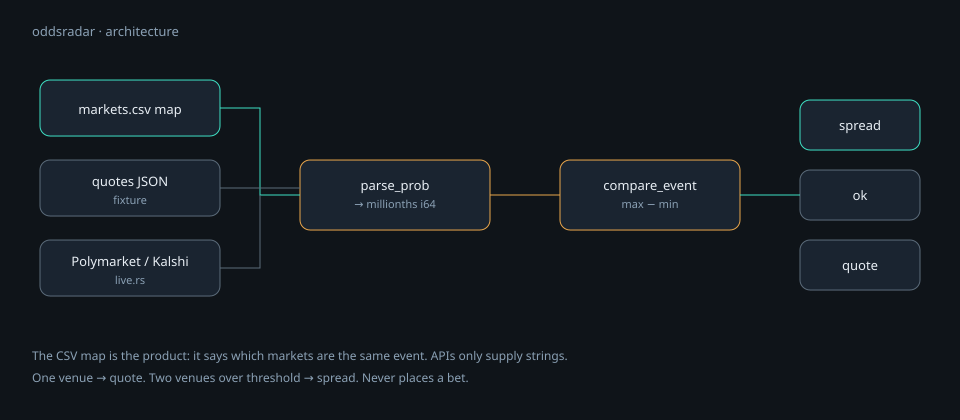

<p align="center">
  
</p>

<h1 align="center">oddsradar</h1>

<p align="center">
  <strong>Read-only cross-venue prediction-market spread radar.</strong><br>
  Same event, several books, one comparison table. No bets.
</p>

<p align="center">
  <a href="README.md"><strong>English</strong></a> ·
  <a href="README.zh-CN.md">中文</a> ·
  <a href="learn/README.md">Learn</a> ·
  <a href="docs/PROJECT-PLAN.md">Plan</a> ·
  <a href="SECURITY.md">Security</a>
</p>

<p align="center">
  
  
  
  
</p>

---

Watch the same event on Polymarket, Kalshi, and Hyperliquid outcome markets. When implied Yes probabilities diverge past a threshold you set, oddsradar prints a `spread` row (and can append it to a JSONL file).

> This is **not** a bookie and **not** an arb bot. It is a comparison table with alerts. Crossing the spread yourself is your decision, on your own venue accounts.

## Why this exists

Prediction markets sell shares of “will this happen?”. A Yes last price near 0.62 is a rough implied probability of 62% — liquidity and fees sit on top, so it is not a statistical identity.

The same headline can trade on more than one venue. A wide gap is either stale information, or the contracts are not actually the same event (expiry, wording, resolution source). There is no universal event id, so **you** maintain the map. That is tedious, and it is the honest part of the product.

## Features

| | |
|---|---|
| **Hand-maintained map** | CSV `event_id,venue,market_id`. Semantics stay with you. |
| **Integer probability** | Millionths (`1_000_000 = 100%`). Compare with integer subtraction. |
| **Fixture and live share one engine** | Network code only fetches strings. |
| **One-sided quotes still print** | `kind: quote` if only one venue is live — so a half-wired map is not silent. |
| **Public APIs only** | Polymarket Gamma + Kalshi REST. No scraping HTML when an API exists. |

## How it works

<p align="center">
  
</p>

| `kind` | Meaning |
|---|---|
| `spread` | At least two venues, `max(yes) − min(yes)` ≥ threshold. |
| `ok` | At least two venues, spread under threshold. |
| `quote` | Only one venue quoted this `event_id`. |

Default threshold is `50000` millionths (5 percentage points), overridable with `--threshold` or `config.threshold_millionths`.

## Requirements

- [Rust](https://www.rust-lang.org/tools/install) **1.85** (pinned in `rust-toolchain.toml`)
- Outbound HTTPS to Polymarket / Kalshi for `--live`

```bash
git clone https://github.com/toolazytoname/oddsradar.git
cd oddsradar
cargo test
```

## Quick start

**Fixture (offline):**

```bash
cargo run -- compare \
  --config fixtures/config.ok.json \
  --map fixtures/markets.csv \
  --quotes fixtures/quotes_wide.json
```

`btc-100k` should come back as `kind: spread`; `fed-cut` as `ok`.

**Live (public APIs, still no orders):**

```bash
cargo run -- compare \
  --config fixtures/config.ok.json \
  --map fixtures/markets.live.example.csv \
  --live
```

The example map has a Polymarket id only, so you should see `kind: quote` and a real implied probability — not a made-up number. Add a Kalshi ticker for the **same resolution rules** before you expect `spread`.

## Map format

`fixtures/markets.csv`:

```csv
event_id,venue,market_id
btc-100k,polymarket,pm-btc-100k
btc-100k,kalshi,kx-btc-100k
btc-100k,hyperliquid,hl-btc-100k
```

Live Polymarket `market_id` is the numeric Gamma id (see `fixtures/markets.live.example.csv`). Kalshi uses the ticker. Confirm settlement rules match before you join two rows under one `event_id`.

## CLI

| Command | Purpose |
|---|---|
| `doctor --config FILE` | Reject forbidden secret field names; print threshold. |
| `compare --config FILE --map FILE --quotes FILE` | Offline compare. |
| `compare --config FILE --map FILE --live` | Pull public venue APIs. |
| `compare … --threshold N --notify-file PATH` | Override threshold; append `spread` rows as JSONL. |

## Tests

```bash
cargo test
```

Live parsing is pinned against recorded official JSON (`fixtures/polymarket_market.json`) so a vendor field rename fails the suite instead of silently returning 0.

## Security

Read **[`SECURITY.md`](SECURITY.md)**. This process must never hold venue trading credentials or wallet seeds. Prefer official APIs over scraping. Notification tokens (when you add them) live in `.env` with mode `0600`, never in git.

## Non-goals

- Place bets or outcome-contract orders
- Become a market / house
- Auto-align every election market on earth (wrong match = fake arb)
- A directory of 200 unrelated tools

## Learn

[`learn/`](learn/) walks through implied probability, the string-wrapped Polymarket `outcomePrices` pitfall, and why Kalshi `last_price_dollars = "0.0000"` is often “no trade yet”. Cover animation: [`learn/assets/cover.mp4`](learn/assets/cover.mp4).

## Related

- [hlsentry](https://github.com/toolazytoname/hlsentry) — Hyperliquid liquidation sentry
- [chaintail](https://github.com/toolazytoname/chaintail) — local EVM log tail
- [x402-stall](https://github.com/toolazytoname/x402-stall) — HTTP 402 stall for unique data

## License

[MIT](LICENSE) © 2026 toolazytoname
